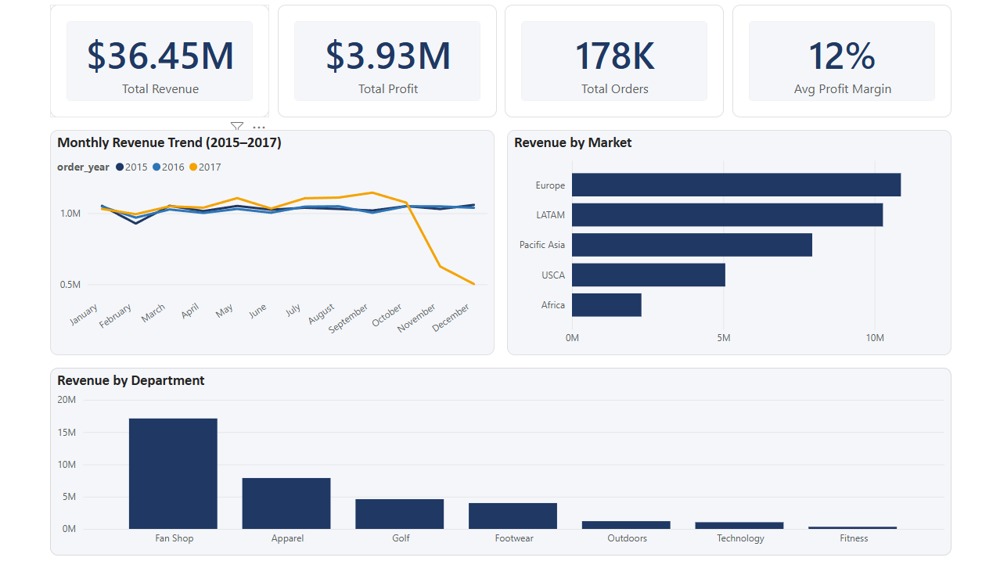
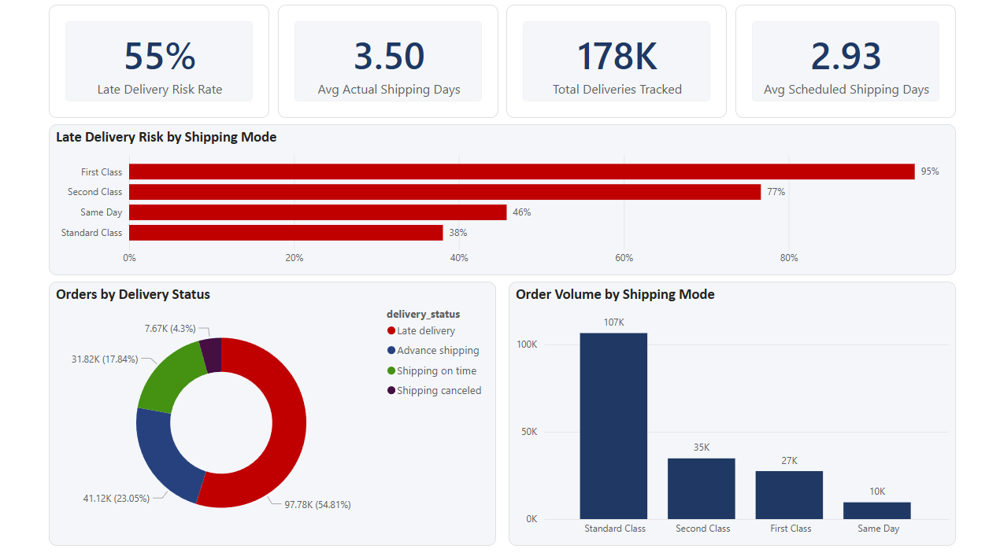
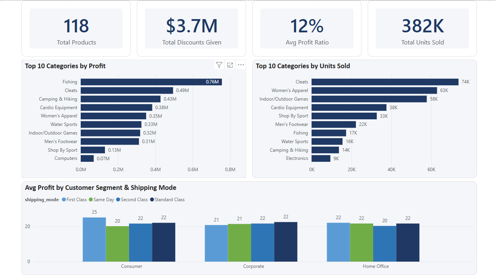
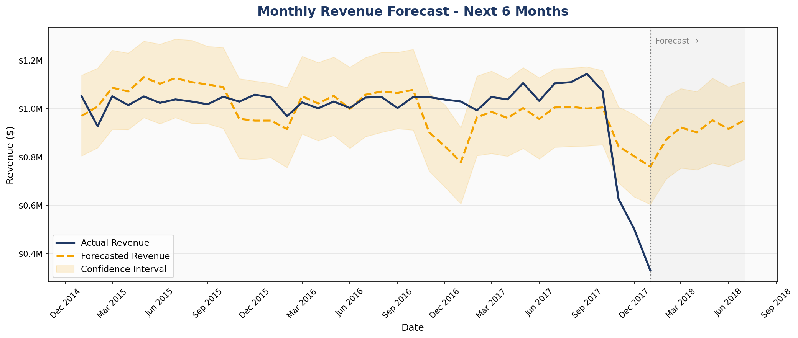

# Supply Chain Analytics Project

## Overview
End-to-end supply chain analytics project analyzing **180,511 orders** across 5 global markets (2015–2017). Built a complete analytics pipeline from raw data to business insights using Python, PostgreSQL, Power BI, and Prophet forecasting.

---

## Tech Stack
| Tool | Purpose |
|------|---------|
| Python (Pandas) | Data cleaning & transformation |
| PostgreSQL | Data warehouse & SQL analytics |
| Power BI | Interactive business dashboards |
| Prophet | Revenue demand forecasting |

---

## Key Business Insights

1. **$36.45M total revenue** across 180K orders with a 12% avg profit margin
2. **55% late delivery risk** — systemic issue across all markets, not region-specific
3. **First Class shipping has 95% late delivery risk** despite being a premium option
4. **Fishing is the #1 profit category** ($756K) but ranks 7th in units sold — high margin, low volume
5. **Fan Shop drives 47% of total revenue** ($17.1M out of $36.45M)
6. **$3.7M in discounts given** — nearly matching total profit of $3.93M
7. **Prophet forecast** predicts $872K–$952K monthly revenue for H1 2018

---

## Project Structure

supply-chain-analytics/
├── data/
│   ├── raw/                  # Original DataCo dataset
│   └── cleaned/              # Cleaned dataset (180,511 rows, 51 columns)
├── sql/
│   └── analysis_queries.sql  # 10 business analytics queries
├── notebooks/
│   ├── clean_data.py         # Data cleaning pipeline
│   ├── load_to_postgres.py   # PostgreSQL data loader
│   └── forecasting.py        # Prophet demand forecasting
├── dashboard/
│   └── supply_chain_dashboard.pbix
├── screenshots/              # Dashboard & forecast visuals
└── business-insights/        # Business recommendations

---

## 🗄️ Database Schema
- **Table:** `orders`
- **Rows:** 180,511
- **Columns:** 51
- **Database:** PostgreSQL 17

---

## Dashboards

### 1. Executive Summary


### 2. Delivery Performance


### 3. Product Analysis


### 4. Revenue Forecast


---

## How to Run

### 1. Install dependencies
```bash
pip install pandas sqlalchemy psycopg2-binary prophet matplotlib
```

### 2. Set up PostgreSQL
```bash
psql -U postgres -c "CREATE DATABASE supply_chain;"
```

### 3. Run the pipeline
```bash
python notebooks/clean_data.py
python notebooks/load_to_postgres.py
python notebooks/forecasting.py
```

### 4. Open dashboard
Open `dashboard/supply_chain_dashboard.pbix` in Power BI Desktop

---

## Data Source
[DataCo Smart Supply Chain Dataset](https://www.kaggle.com/datasets/shashwatwork/dataco-smart-supply-chain-for-big-data-analysis) — Kaggle

---

## Author
**Aswathy Chandrasekar**
[LinkedIn](https://www.linkedin.com/in/aswathychandrasekar/) | [GitHub](https://github.com/aswathy-chandrasekar)